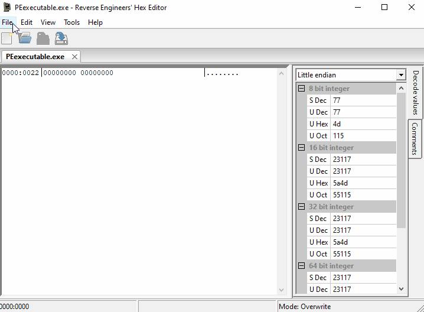

# PEexecutable-ReverseEngineering

## Reverse Engineers' Hex Editor | rehex by Daniel Collins (solemnwarning)

For taking notes and learning we need a proper Hex Editor, for this time I will use:  
https://github.com/solemnwarning/rehex/releases/download/0.3.91/rehex-0.3.91-win-x86_64.zip

### Bugs in the rehex
#### Not rendering after opening a file
After opening a file with rehex, there is a need to use  
`Mouse middle button` to `scroll up` and `scroll down` to trigger the proper rendering by rehex.
#### This .gif shows that scrolling up with a mouse, rehex reveals the comments and proper Hex dump and ASCII viewer output 

#### Unable to insert **at the end of line** in the ASCII viewer or in the Hex Dump 
Simply press `down key↓` or and `up key↑` on the keyboard and it will take you to the last character or at the end of the Hex line.

## Experimental PE executable example to research
https://storage.googleapis.com/google-code-archive-downloads/v2/code.google.com/corkami/PE101.zip
